# STEDI Human Balance Analytics - Data Lakehouse Project

## Overview

This project involves building a data lakehouse for STEDI’s Human Balance Analytics using AWS services. The primary objective is to create a data pipeline that ingests, sanitizes, and curates data from various sources, making it suitable for training machine learning models that analyze human balance data.

Data sources include customer information from the STEDI website, accelerometer data from mobile applications, and step trainer readings from IoT devices. The project follows a structured workflow, transforming raw data through multiple zones (landing, trusted, and curated) with a series of AWS Glue jobs.

## Project Architecture

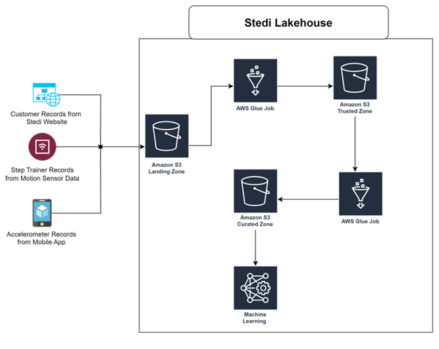

The project employs the following AWS services:
- **AWS S3**: Used as the primary storage for the data lake, divided into landing, trusted, and curated zones.
- **AWS Glue**: Manages ETL processes, transforms data, and creates dynamic tables in the Glue Data Catalog.
- **AWS Athena**: Provides SQL-based querying of data within each zone.
- **Python & PySpark**: Utilized for scripting ETL jobs to clean and join data across various stages.

### Data Flow Diagram Explanation
1. **Landing Zone**: Raw data is ingested here, where it resides in its original JSON format in S3.
2. **Trusted Zone**: Data is sanitized here, filtering out records based on customer consent to share data.
3. **Curated Zone**: Final transformed datasets are joined here, ready for machine learning applications. Only records with complete customer and sensor data are moved to this zone.

## Workflow

1. **Landing Zone**: Raw data from JSON files is loaded into S3 buckets and ingested as initial tables in the Glue Data Catalog.
2. **Trusted Zone**: Data is sanitized to include only customers who opted to share their data. Separate Glue jobs are created for each data source to filter and store this data.
3. **Curated Zone**: Joins customer and device data for customers with both accelerometer and step trainer data. This final set is ready for machine learning applications.

## Data Sources

- **Customer Records** (`customer_landing`): Data from the STEDI website with details about customers, including email, registration dates, and share preferences.
- **Accelerometer Records** (`accelerometer_landing`): Data from the mobile app, containing timestamped x, y, and z readings.
- **Step Trainer Records** (`step_trainer_landing`): Data from the IoT devices capturing `sensorReadingTime`, `serialNumber`, and `distanceFromObject`.

## Data Dictionary

Here’s a brief overview of key columns in each data source:

- **Customer Table**:
  - `serialnumber`: Unique identifier for each customer.
  - `email`: Customer's email address.
  - `customername`: Name of the customer.
  - `phone`: Customer's phone number.
  - `birthday`: Date of birth.
  - `registrationdate`: Date the customer registered for the STEDI app.
  - `lastupdatedate`: Date when the customer profile was last updated.
  - `sharewithpublicasofdate`: Date the customer consented to public data sharing.
  - `sharewithfriendsasofdate`: Date the customer consented to data sharing with friends.
  - `sharewithresearchasofdate`: Date the customer consented to data sharing for research purposes.
  
- **Accelerometer Table**:
  - `timestamp`: Timestamp for the accelerometer reading.
  - `user`: Identifier linking to the customer, typically by email.
  - `x`, `y`, `z`: Accelerometer axis readings.

- **Step Trainer Table**:
  - `sensorReadingTime`: Timestamp for the step trainer reading.
  - `serialNumber`: Unique identifier for the step trainer device.
  - `distanceFromObject`: Distance measurement from the step trainer sensor.

## Requirements for Submission

### Python ETL Scripts

The following Python scripts were created to manage data transformation in each zone:

1. **`customer_landing_to_trusted.py`** - Filters customer records to retain only those who agreed to share data for research.
2. **`accelerometer_landing_to_trusted.py`** - Filters accelerometer readings for customers who opted in.
3. **`customer_trusted_to_curated.py`** - Joins `customer_trusted` and `accelerometer_trusted` tables, creating the `customers_curated` dataset.
4. **`step_trainer_landing_to_trusted.py`** - Sanitizes step trainer records, linking them with curated customer data.
5. **`machine_learning_curated.py`** - Aggregates accelerometer and step trainer readings to prepare a `machine_learning_curated` dataset.

### SQL Scripts

Each script was used to create tables in AWS Athena from the JSON files in the landing zone:

1. **`customer_landing.sql`** - Creates the `customer_landing` table.
2. **`accelerometer_landing.sql`** - Creates the `accelerometer_landing` table.
3. **`step_trainer_landing.sql`** - Creates the `step_trainer_landing` table.
4. **`customer_trusted.sql`** - Creates the `customer_trusted` table.
5. **`accelerometer_trusted.sql`** - Creates the `accelerometer_trusted` table.
6. **`customer_curated.sql`** - Creates the `customers_curated` table.
7. **`step_trainer_trusted.sql`** - Creates the `step_trainer_trusted` table.
8. **`machine_learning_curated.sql`** - Creates the `machine_learning_curated` table.

### Screenshots from Athena

Below are the essential screenshots of queries and results that validate each step of the ETL pipeline:

1. **Sample Data Query Results**:
   
   - Customer Landing Sample:
     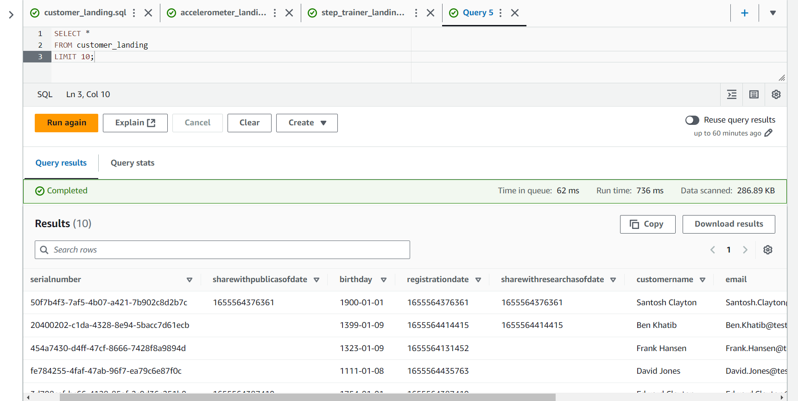
   
   - Accelerometer Landing Sample:
     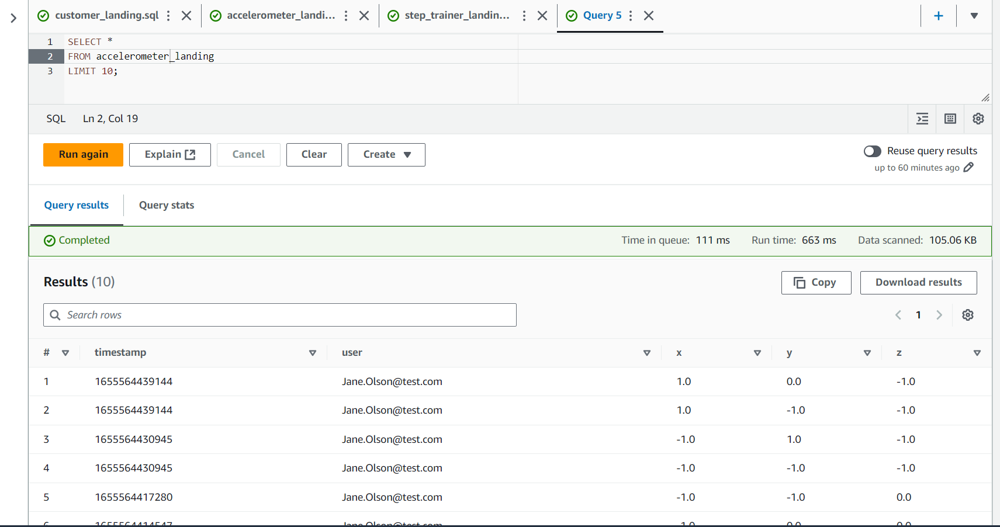
   
   - Machine Learning Curated Sample:
     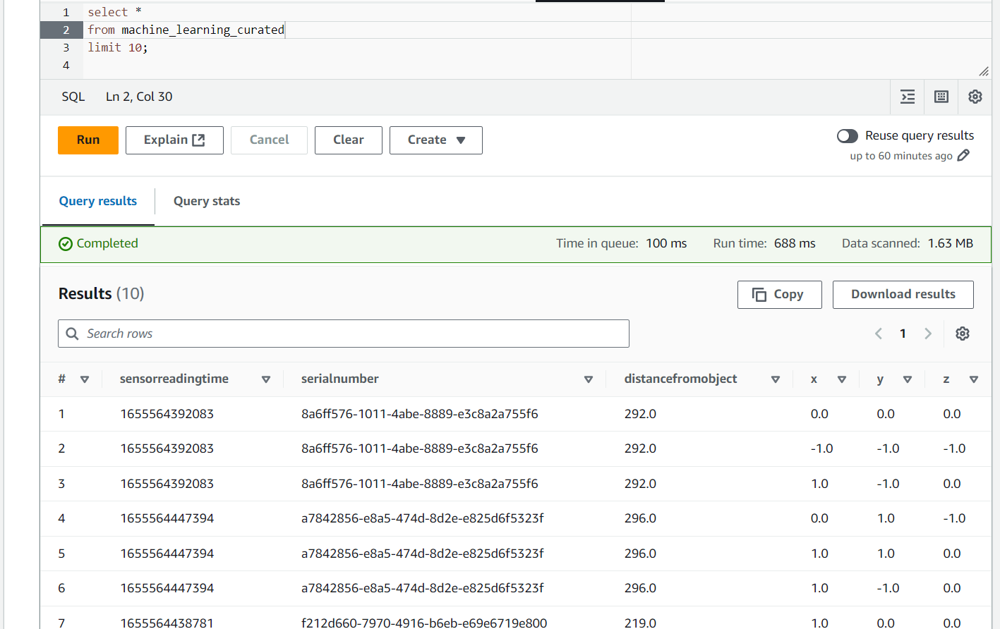
   
2. **Total Record Counts**:
   
   - Customer Landing Total Records:
     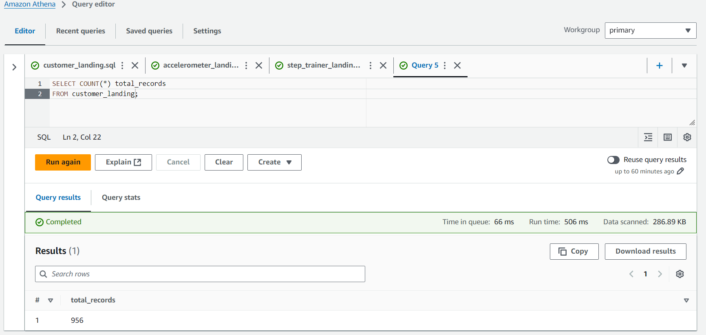
   
   - Accelerometer Landing Total Records:
     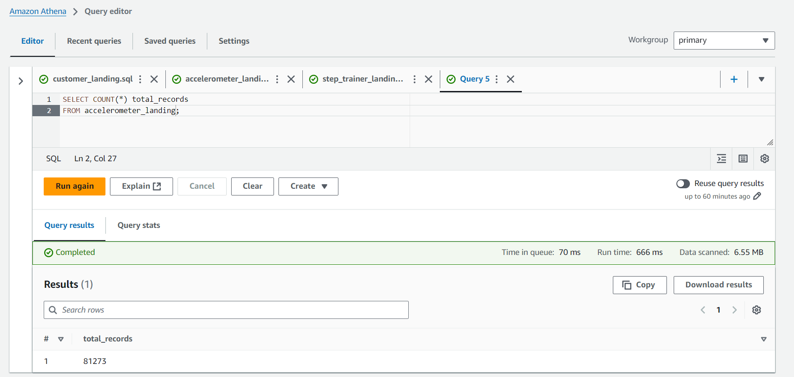
   
   - Customer Trusted Total Records:
     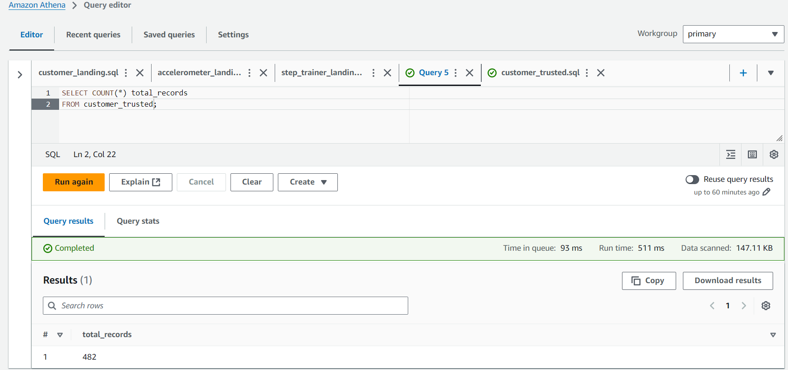

  - Customer Trusted with No Rows Where `sharewithresearchasofdate` is Null:
    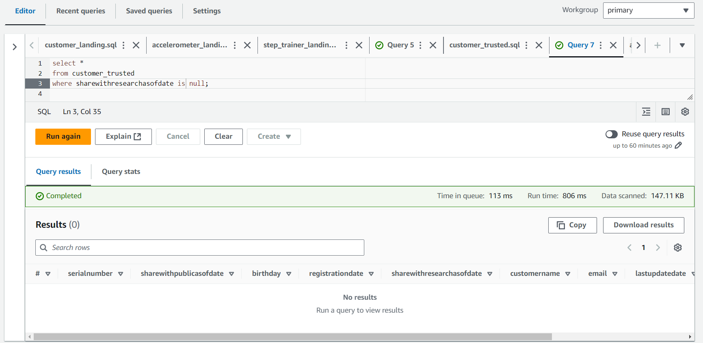
   
   - Accelerometer Trusted Total Records:
     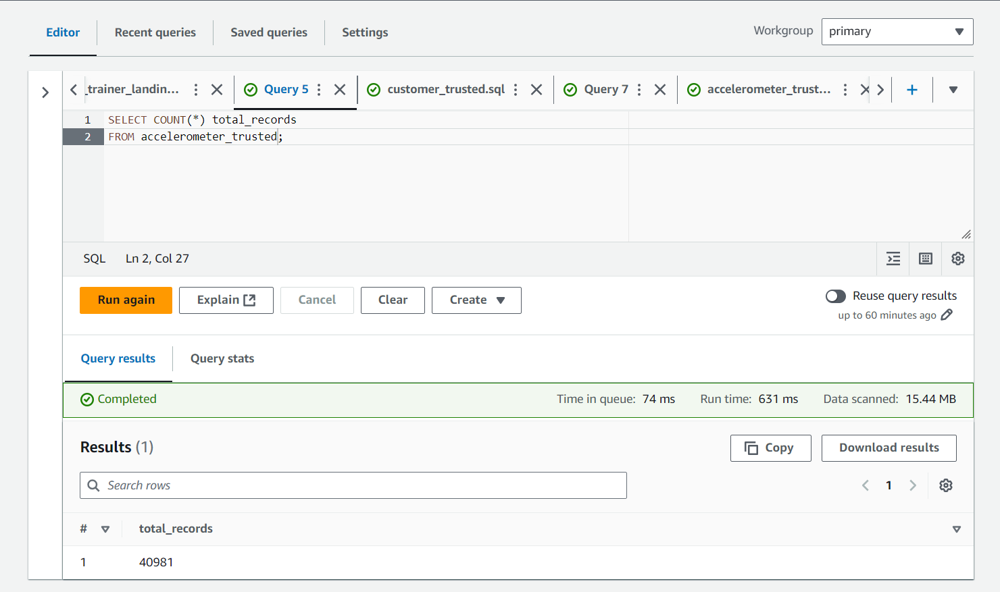
   
   - Customer Curated Total Records:
     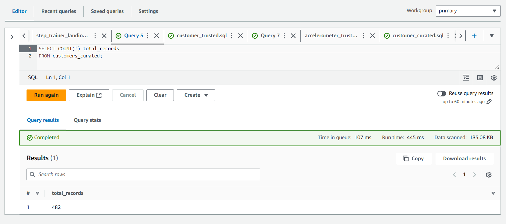
   
   - Machine Learning Curated Total Records:
     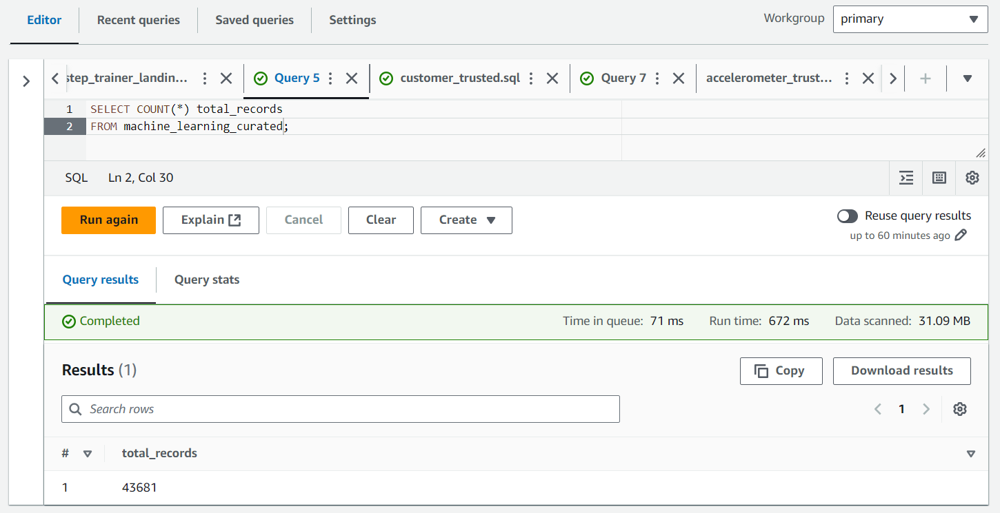

### Troubleshooting & Known Issues

- **Field Name Conflicts**: AWS Glue can sometimes handle fields inconsistently, especially with case-sensitive names (`serialnumber` vs. `serialNumber`). Ensure fields are aligned across all scripts.
- **Glue Job Execution**: Occasionally, jobs may produce unexpected results if fields are dropped incorrectly. Use SQL Transform nodes where possible to control field names.
- **Performance Tips**: Athena queries on large datasets can be optimized by partitioning or pre-filtering data where possible.

### Final Checklist

- [x] **Python Scripts**: All five ETL scripts developed and executed.
- [x] **SQL Scripts**: All eight SQL scripts executed in Athena for data creation.
- [x] **Screenshots**: Captured queries for each stage and validated record counts.
- [x] **Data Verification**: Ensured data consistency and record accuracy across zones.

## Instructions for Running the Project

1. **Set Up S3 Buckets**:
   - Create a bucket named `jmk-stedi-lakehouse-project` with subdirectories for `customer_landing`, `step_trainer_landing`, and `accelerometer_landing`.

2. **Run SQL Scripts**:
   - Execute each SQL script in Athena to create the necessary tables in the `stedi_project_db` database.

3. **Execute ETL Jobs**:
   - Run each Python script in AWS Glue, ensuring that jobs are pointing to the correct database and S3 bucket paths.

4. **Verify Data in Athena**:
   - After each job, query the relevant tables in Athena to validate data transformations and record counts.

## Additional Notes

